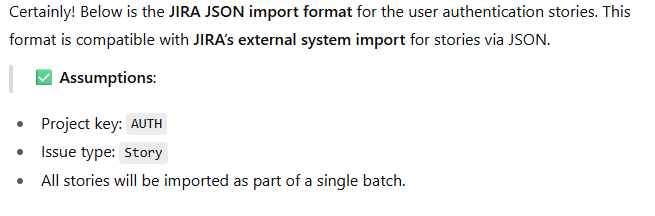
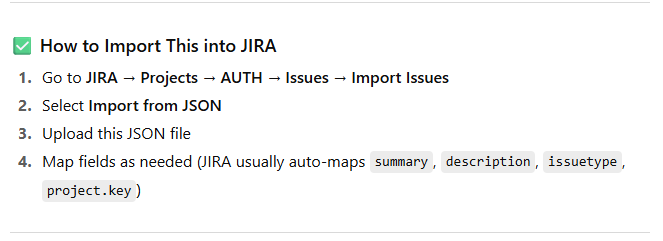
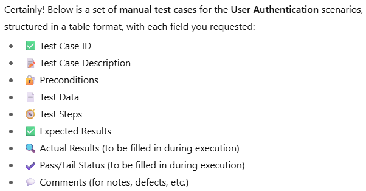
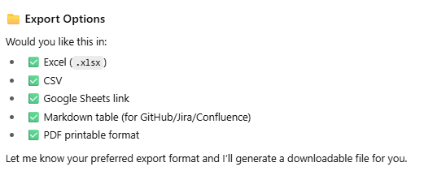

GenAI-SDLC-1

This directory contanins detailed information for [GenAI-Driven SDLC](https://ozdemirtim.medium.com/d7b02c673bb0)

<br>**Prompt**: export these JIRA stories as JIRA JSON import format

<br>Response:



```json

[
  {
    "fields": {
      "project": { "key": "AUTH" },
      "summary": "User should be able to log in with valid credentials",
      "description": "As a registered user, I want to log in using a valid user ID and password so that I can access my account.",
      "customfield_ac": [
        "Given a valid user ID and password",
        "When a login request is sent to `/api/login`",
        "Then the system should respond with a `200 OK` status",
        "And a valid authentication token should be included in the response body"
      ],
      "issuetype": { "name": "Story" }
    }
  },
  {
    "fields": {
      "project": { "key": "AUTH" },
      "summary": "System should reject login with invalid credentials",
      "description": "As a user, I should not be allowed to log in with an invalid user ID or password, and I should receive a clear error message.",
      "customfield_ac": [
        "Given invalid login credentials",
        "When a request is made to `/api/login`",
        "Then the system should respond with a `401 Unauthorized` status",
        "And include a message indicating invalid credentials"
      ],
      "issuetype": { "name": "Story" }
    }
  },
  {
    "fields": {
      "project": { "key": "AUTH" },
      "summary": "System should lock account after 3 failed login attempts",
      "description": "As a user, if I enter incorrect login credentials 3 times consecutively, the system should temporarily lock my account to prevent brute-force attacks.",
      "customfield_ac": [
        "Given a user who fails to log in 3 times in a row",
        "When the third login attempt fails",
        "Then the system should lock the account",
        "And any subsequent login attempts should return a `423 Locked` status",
        "And the lock should last 15 minutes"
      ],
      "issuetype": { "name": "Story" }
    }
  },
  {
    "fields": {
      "project": { "key": "AUTH" },
      "summary": "System should reject login during lockout period",
      "description": "As a user whose account is locked, I should not be able to log in until the lock duration expires or the account is unlocked by an admin.",
      "customfield_ac": [
        "Given an account that is locked due to failed login attempts",
        "When a login is attempted within 15 minutes",
        "Then the system should respond with `423 Locked`"
      ],
      "issuetype": { "name": "Story" }
    }
  },
  {
    "fields": {
      "project": { "key": "AUTH" },
      "summary": "Admin should be able to unlock locked user accounts",
      "description": "As an admin, I should be able to unlock a user's account before the 15-minute lockout expires, to allow earlier access for verified users.",
      "customfield_ac": [
        "Given a locked user account",
        "When the admin sends a request to `/api/admin/unlock` with the user ID",
        "Then the system should unlock the account",
        "And a subsequent login attempt with valid credentials should succeed"
      ],
      "issuetype": { "name": "Story" }
    }
  },
  {
    "fields": {
      "project": { "key": "AUTH" },
      "summary": "Users should be able to initiate password reset with valid email or user ID",
      "description": "As a user, I should be able to reset my password by submitting my registered email or user ID, and the system should send me a reset link.",
      "customfield_ac": [
        "Given a valid user ID or email",
        "When the user submits a request to `/api/forgot-password`",
        "Then the system should respond with `200 OK`",
        "And a reset link should be sent to the registered email"
      ],
      "issuetype": { "name": "Story" }
    }
  },
  {
    "fields": {
      "project": { "key": "AUTH" },
      "summary": "System should reject password reset request for invalid user",
      "description": "As a user, if I try to reset a password using an unregistered email or user ID, I should be notified that no account was found.",
      "customfield_ac": [
        "Given an unregistered user ID or email",
        "When a password reset request is submitted",
        "Then the system should respond with `404 Not Found`",
        "And a message should indicate the user does not exist"
      ],
      "issuetype": { "name": "Story" }
    }
  },
  {
    "fields": {
      "project": { "key": "AUTH" },
      "summary": "System should trigger CAPTCHA after multiple failed login attempts",
      "description": "As a security measure, the system should prompt users to complete a CAPTCHA challenge after multiple failed login attempts to prevent automated abuse.",
      "customfield_ac": [
        "Given two consecutive failed login attempts",
        "When the third attempt is made",
        "Then the system should require CAPTCHA verification",
        "And prevent login until CAPTCHA is successfully completed"
      ],
      "issuetype": { "name": "Story" }
    }
  }
]

```

<br> Also gave instructions on how to upload to JIRA. 




<br>Prompt: Generate manual test cases with test case id, test case description, preconditions, test data, test steps, expected results, actual results, pass/fail status, and comments fields for these scenarios


<br>Response:



Generates the following manual test cases.


And



<br>**Prompt**: Generate downloadable Excel file.

<br>**Response**:

*Your manual test cases are ready for download: [Download Excel file](./assets/user_authentication_test_cases.xlsx)*

Summary
-------


