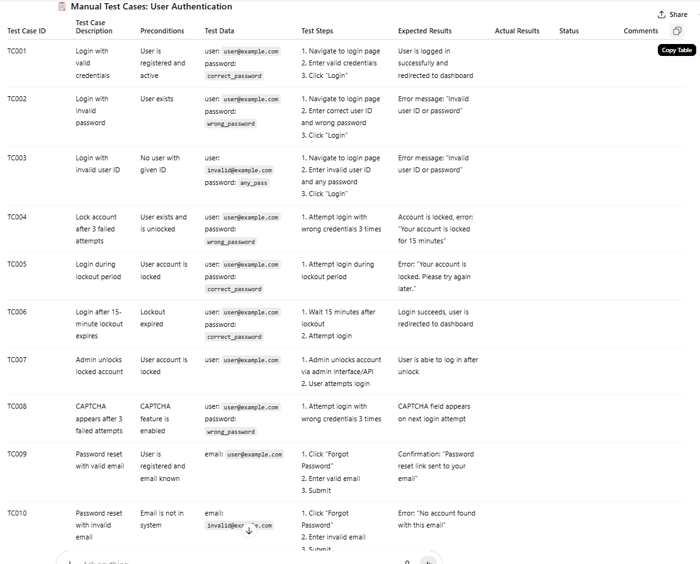

GenAI-SDLC-1

This directory contanins detailed information for [GenAI-Driven SDLC](https://ozdemirtim.medium.com/d7b02c673bb0)

Introduction
---
<br> Exploring which steps of SDLC that GPT can help and what SDLC articfacts GPT can generate. 
<br> This experiment is assuming a human-in-the-loop process model and how GPT will augment software develeper.
<br> There are tools in the market based on Foundation Models but (today) these tools are focusing on sub set of SDLC process. 

<details>
<summary>Can we generate requirements in Gherkin format?</summary>

<br>**Prompt**: Please translate the following requirement to Gherkin format. “User enters user id and password. If the user is invalid or password is invalid, then the system gives an error message. System locks the account 15 mins if three consecutive attempts fail”
<br>**GPT’s Output**:

```

Feature: User Authentication

  Scenario: Successful login with valid credentials
    Given the user navigates to the login page
    When the user enters a valid user ID and valid password
    Then the user should be logged in successfully

  Scenario: Failed login with invalid user ID or password
    Given the user navigates to the login page
    When the user enters an invalid user ID or invalid password
    Then the system should display an error message

  Scenario: Account lockout after 3 consecutive failed login attempts
    Given the user navigates to the login page
    When the user enters invalid credentials 3 times in a row
    Then the system should lock the account for 15 minutes

```
</details>

<details>
<summary>Can we update the first set of requirements with additional requirements?</summary>

<br>**Prompt**: Could you also add scenarios for unlocking and forgot password?
<br>**GPT’s Output**:

 

```
Feature: User Authentication

  Scenario: Successful login with valid credentials
    Given the user navigates to the login page
    When the user enters a valid user ID and valid password
    Then the user should be logged in successfully

  Scenario: Failed login with invalid user ID or password
    Given the user navigates to the login page
    When the user enters an invalid user ID or invalid password
    Then the system should display an error message

  Scenario: Account lockout after 3 consecutive failed login attempts
    Given the user navigates to the login page
    When the user enters invalid credentials 3 times in a row
    Then the system should lock the account for 15 minutes

  Scenario: Unlock account after lock duration expires
    Given the user's account is locked due to 3 failed login attempts
    And 15 minutes have passed since the account was locked
    When the user attempts to log in with valid credentials
    Then the user should be logged in successfully

  Scenario: Reset password using 'Forgot Password' feature
    Given the user is on the login page
    When the user clicks on the "Forgot Password" link
    And enters a valid registered email or user ID
    Then the system should send a password reset link to the user's email
```

 

</details>

<details>
<summary>Can GPT add some use cases to the existing set of requirements?</summary>

<br>**Prompt**: Could you also add edge cases?
<br>**GPT’s Output**:

 

```
Feature: User Authentication

  Scenario: Successful login with valid credentials
    Given the user navigates to the login page
    When the user enters a valid user ID and valid password
    Then the user should be logged in successfully

  Scenario: Failed login with invalid user ID or password
    Given the user navigates to the login page
    When the user enters an invalid user ID or invalid password
    Then the system should display an error message

  Scenario: Account lockout after 3 consecutive failed login attempts
    Given the user navigates to the login page
    When the user enters invalid credentials 3 times in a row
    Then the system should lock the account for 15 minutes

  Scenario: Attempt to login during lockout period
    Given the user's account is locked
    When the user tries to log in with valid credentials
    Then the system should inform the user that the account is locked
    And the user should not be allowed to log in

  Scenario: Unlock account after lock duration expires
    Given the user's account is locked due to 3 failed login attempts
    And 15 minutes have passed since the account was locked
    When the user attempts to log in with valid credentials
    Then the user should be logged in successfully

  Scenario: Admin unlocks account before lock duration expires
    Given the user's account is locked
    And an admin manually unlocks the account
    When the user logs in with valid credentials
    Then the user should be logged in successfully

  Scenario: CAPTCHA required after multiple failed login attempts
    Given the user has failed to log in 2 times
    When the user attempts to log in a third time
    Then the system should require CAPTCHA verification

  Scenario: Reset password using 'Forgot Password' feature
    Given the user is on the login page
    When the user clicks on the "Forgot Password" link
    And enters a valid registered email or user ID
    Then the system should send a password reset link to the user's email

  Scenario: Attempt password reset with unregistered email or user ID
    Given the user is on the "Forgot Password" page
    When the user enters an unregistered email or user ID
    Then the system should display an error indicating the account does not exist

```
</details>

<details>
<summary>Can GPT generate JIRA stories?</summary>

<br>**Prompt**: Generate JIRA stories having summary, description, and acceptance criteria for each scenario.
<br>**GPT’s Output**:


```
# JIRA Stories

## Story 1: Login with Valid Credentials
**Summary:** User logs in with valid credentials  
**Description:** As a user, I want to log in using my valid user ID and password so that I can access my account.  
**Acceptance Criteria:**  
- Given a registered and active user  
- When they enter correct user ID and password  
- Then they are logged in successfully and redirected to the dashboard  

## Story 2: Login with Invalid Password
**Summary:** User attempts login with incorrect password  
**Description:** As a user, I want to be notified if my password is incorrect so I can try again.  
**Acceptance Criteria:**  
- Given a registered user  
- When they enter correct user ID but incorrect password  
- Then the system displays an "Invalid user ID or password" error message  

## Story 3: Login with Invalid User ID
**Summary:** User attempts login with non-existent account  
**Description:** As a user, I want to be notified if my account doesn't exist so I can register or correct my entry.  
**Acceptance Criteria:**  
- Given no account exists with provided user ID  
- When they attempt login  
- Then the system displays an "Invalid user ID or password" error message  

## Story 4: Account Lock After 3 Failed Attempts
**Summary:** System locks account after multiple failed logins  
**Description:** As a user, I want my account locked after 3 failed login attempts to protect against unauthorized access.  
**Acceptance Criteria:**  
- Given a registered and active account  
- When user enters wrong credentials 3 consecutive times  
- Then the account is locked for 15 minutes  

## Story 5: Login During Lockout Period
**Summary:** User attempts login while account is locked  
**Description:** As a user, I want to be notified when my account is locked so I know when to retry.  
**Acceptance Criteria:**  
- Given a locked account  
- When the user tries to log in  
- Then they see a message that account is locked for 15 minutes  

## Story 6: Login After Lockout Expires
**Summary:** User logs in successfully after lockout period  
**Description:** As a user, I want to be able to log in after the lockout period ends.  
**Acceptance Criteria:**  
- Given account was locked but lockout time has expired  
- When user enters valid credentials  
- Then login is successful  

## Story 7: Admin Unlocks Locked Account
**Summary:** Admin manually unlocks a user's account  
**Description:** As an admin, I want to unlock locked user accounts so they can log in before the lockout period ends.  
**Acceptance Criteria:**  
- Given account is locked  
- When admin unlocks the account  
- Then the user can log in immediately with valid credentials  

## Story 8: CAPTCHA after Multiple Failed Attempts
**Summary:** Display CAPTCHA after failed logins  
**Description:** As a system, I want to display a CAPTCHA after 3 failed attempts to prevent bots.  
**Acceptance Criteria:**  
- Given a registered user  
- When they fail to log in 3 times  
- Then a CAPTCHA challenge appears on next login attempt  

## Story 9: Password Reset with Valid Email
**Summary:** User requests password reset with valid email  
**Description:** As a user, I want to reset my password when I forget it by entering my registered email.  
**Acceptance Criteria:**  
- Given a registered user  
- When they request a password reset with their valid email  
- Then system sends password reset link to their email  

## Story 10: Password Reset with Invalid Email
**Summary:** User requests password reset with unregistered email  
**Description:** As a user, I want to be notified if my entered email is not associated with any account.  
**Acceptance Criteria:**  
- Given no account exists with entered email  
- When user requests a password reset  
- Then system shows "No account found with this email" message
``` 

<br>**Prompt**: Export these JIRA stories as JIRA JSON import format.
<br>**GPT’s Output**:


```json

[
  {
    "fields": {
      "project": { "key": "AUTH" },
      "summary": "User should be able to log in with valid credentials",
      "description": "As a registered user, I want to log in using a valid user ID and password so that I can access my account.",
      "customfield_ac": [
        "Given a valid user ID and password",
        "When a login request is sent to `/api/login`",
        "Then the system should respond with a `200 OK` status",
        "And a valid authentication token should be included in the response body"
      ],
      "issuetype": { "name": "Story" }
    }
  },
  {
    "fields": {
      "project": { "key": "AUTH" },
      "summary": "System should reject login with invalid credentials",
      "description": "As a user, I should not be allowed to log in with an invalid user ID or password, and I should receive a clear error message.",
      "customfield_ac": [
        "Given invalid login credentials",
        "When a request is made to `/api/login`",
        "Then the system should respond with a `401 Unauthorized` status",
        "And include a message indicating invalid credentials"
      ],
      "issuetype": { "name": "Story" }
    }
  },
  {
    "fields": {
      "project": { "key": "AUTH" },
      "summary": "System should lock account after 3 failed login attempts",
      "description": "As a user, if I enter incorrect login credentials 3 times consecutively, the system should temporarily lock my account to prevent brute-force attacks.",
      "customfield_ac": [
        "Given a user who fails to log in 3 times in a row",
        "When the third login attempt fails",
        "Then the system should lock the account",
        "And any subsequent login attempts should return a `423 Locked` status",
        "And the lock should last 15 minutes"
      ],
      "issuetype": { "name": "Story" }
    }
  },
  {
    "fields": {
      "project": { "key": "AUTH" },
      "summary": "System should reject login during lockout period",
      "description": "As a user whose account is locked, I should not be able to log in until the lock duration expires or the account is unlocked by an admin.",
      "customfield_ac": [
        "Given an account that is locked due to failed login attempts",
        "When a login is attempted within 15 minutes",
        "Then the system should respond with `423 Locked`"
      ],
      "issuetype": { "name": "Story" }
    }
  },
  {
    "fields": {
      "project": { "key": "AUTH" },
      "summary": "Admin should be able to unlock locked user accounts",
      "description": "As an admin, I should be able to unlock a user's account before the 15-minute lockout expires, to allow earlier access for verified users.",
      "customfield_ac": [
        "Given a locked user account",
        "When the admin sends a request to `/api/admin/unlock` with the user ID",
        "Then the system should unlock the account",
        "And a subsequent login attempt with valid credentials should succeed"
      ],
      "issuetype": { "name": "Story" }
    }
  },
  {
    "fields": {
      "project": { "key": "AUTH" },
      "summary": "Users should be able to initiate password reset with valid email or user ID",
      "description": "As a user, I should be able to reset my password by submitting my registered email or user ID, and the system should send me a reset link.",
      "customfield_ac": [
        "Given a valid user ID or email",
        "When the user submits a request to `/api/forgot-password`",
        "Then the system should respond with `200 OK`",
        "And a reset link should be sent to the registered email"
      ],
      "issuetype": { "name": "Story" }
    }
  },
  {
    "fields": {
      "project": { "key": "AUTH" },
      "summary": "System should reject password reset request for invalid user",
      "description": "As a user, if I try to reset a password using an unregistered email or user ID, I should be notified that no account was found.",
      "customfield_ac": [
        "Given an unregistered user ID or email",
        "When a password reset request is submitted",
        "Then the system should respond with `404 Not Found`",
        "And a message should indicate the user does not exist"
      ],
      "issuetype": { "name": "Story" }
    }
  },
  {
    "fields": {
      "project": { "key": "AUTH" },
      "summary": "System should trigger CAPTCHA after multiple failed login attempts",
      "description": "As a security measure, the system should prompt users to complete a CAPTCHA challenge after multiple failed login attempts to prevent automated abuse.",
      "customfield_ac": [
        "Given two consecutive failed login attempts",
        "When the third attempt is made",
        "Then the system should require CAPTCHA verification",
        "And prevent login until CAPTCHA is successfully completed"
      ],
      "issuetype": { "name": "Story" }
    }
  }
]

```

<br> Also gave instructions on how to upload to JIRA. 


</details>

<details>
<summary>Can GPT generate manual test cases for these scenarios?</summary>

<br>Prompt: Generate manual test cases with test case id, test case description, preconditions, test data, test steps, expected results, actual results, pass/fail status, and comments fields for these scenarios
<br>**GPT’s Output**:


Generated the following manual test cases.



And, suggested some file formats that it can generate these test cases.


<br>**Prompt**: Generate downloadable Excel file.
<br>**GPT’s Output**:
*Your manual test cases are ready for download: [Download Excel file](./assets/user_authentication_test_cases.xlsx)*

</details>

<details>
<summary>
Can we generate test automation code?
</summary>

<br>**Prompt**: could you please generate automated test skeletons in robot framework
<br>**GPT’s Output**:
Before generating any code, GPT answers that the RESTful API will have the following endpoints. This will be API-Under-Test.

</details>


Summary
-------
<br> GPT was able to generate useful artifacts, that will increase the productivity. 
<br> Engineer needs to review and correct if needed. But it seems, GPT can do lots of **undifferentiated heavy lifting** today for us. This will also have popsitive impact to **quality** dimension. 


