Introduction
=======

 **Prompt**: generate a card for data product catalog

 **GPT’s Output**:

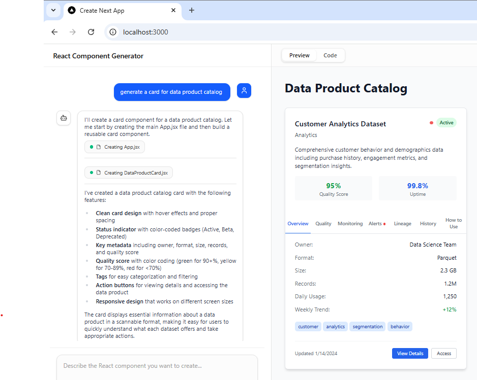

 **Analysis**:

 **Prompt**: generate a card for data product catalog

 **GPT’s Output**:

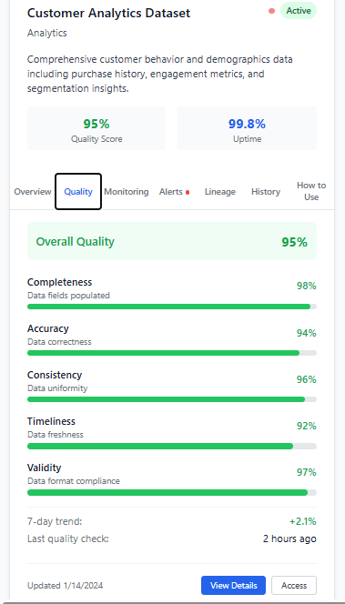

 **Analysis**:

 **Prompt**: generate a card for data product catalog

 **GPT’s Output**:

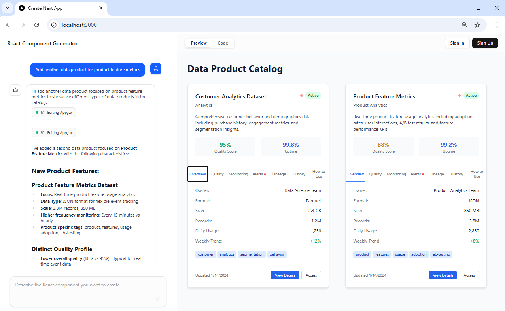

 **Prompt**: add guide for how to consume

 **GPT’s Output**:

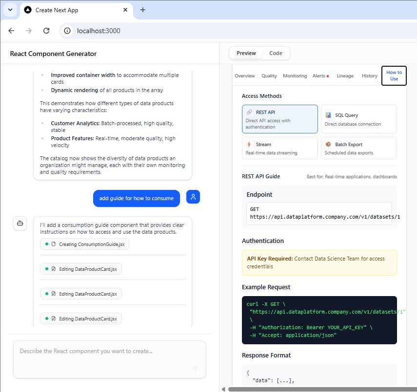
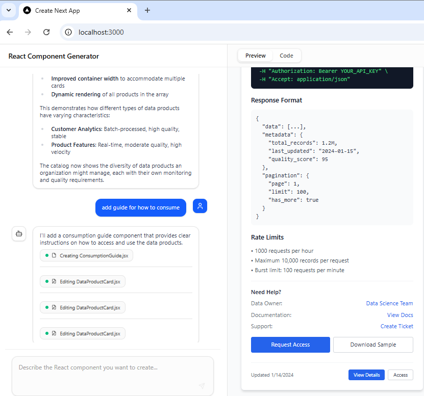

 **Analysis**:

 **GPT’s Output**:

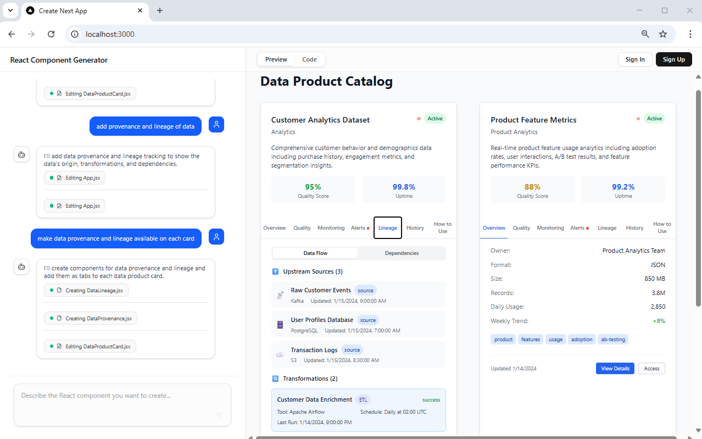
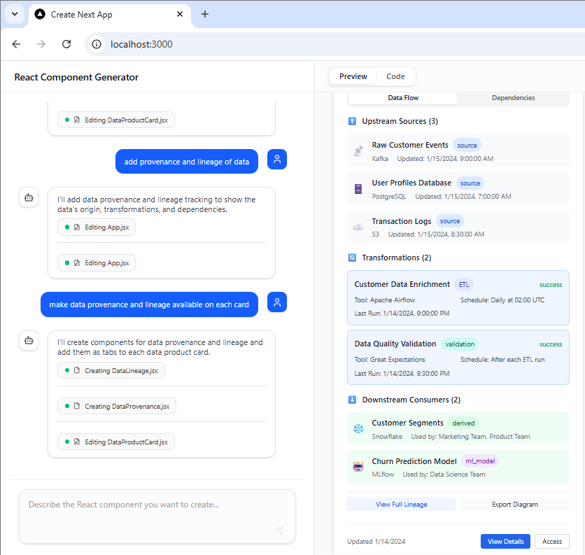
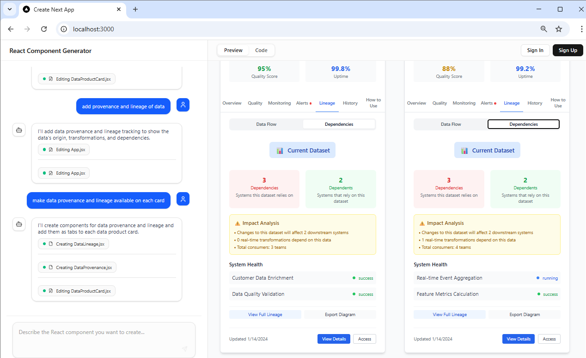

 **GPT’s Output**: 6

 **GPT’s Output**: 7

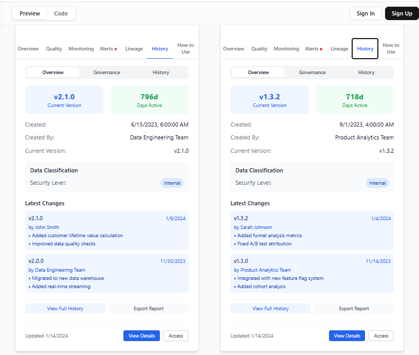

 **GPT’s Output**: 8

 **GPT’s Output**: 9

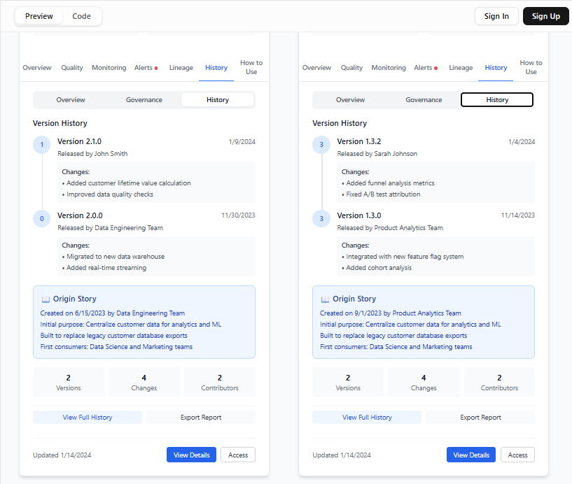

 **GPT’s Output**: 10

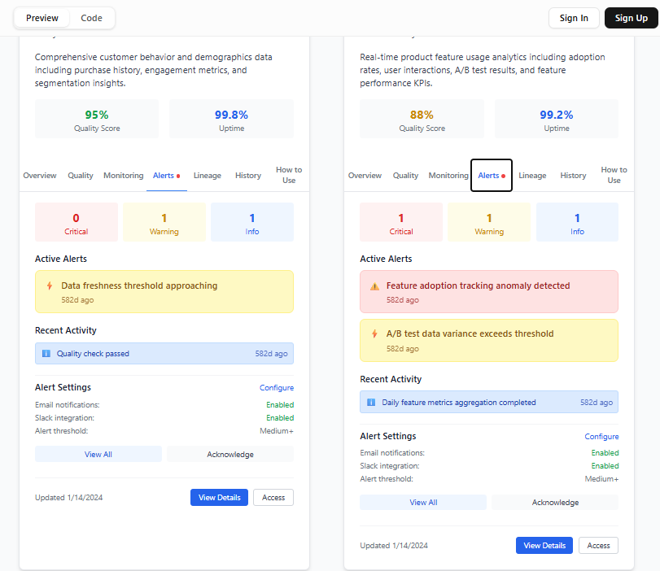

 **GPT’s Output**:11

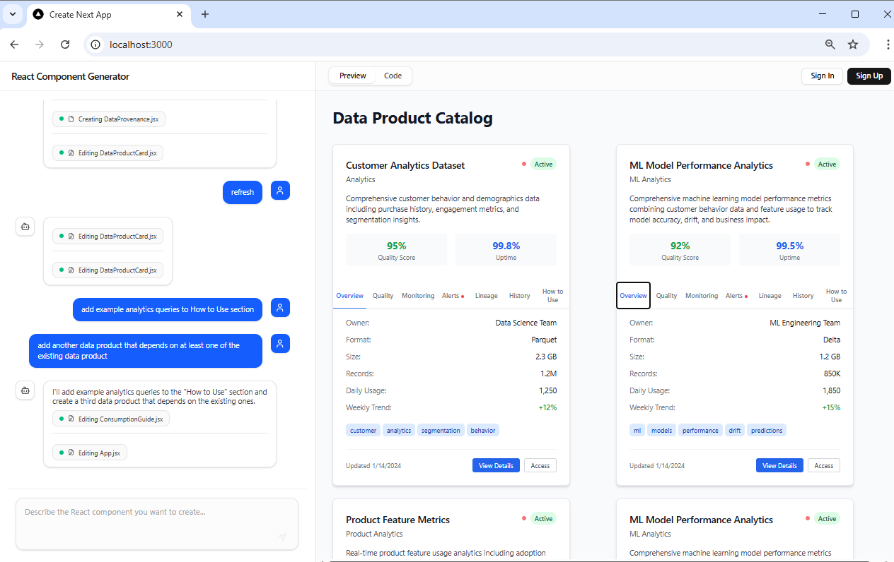

 **GPT’s Output**:12

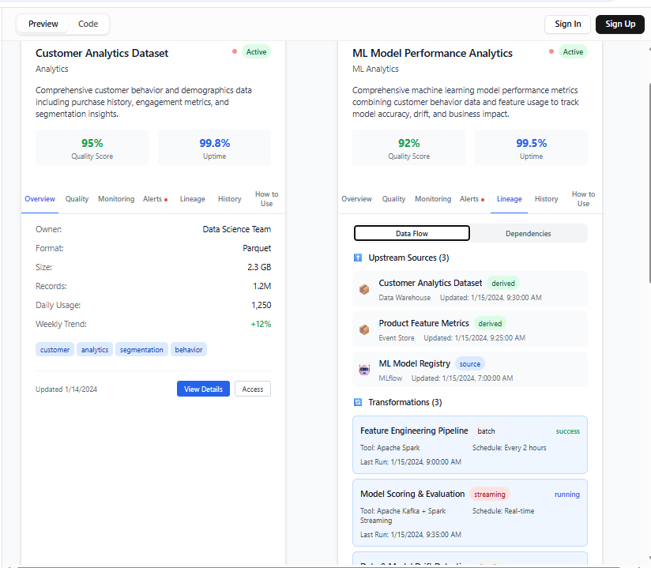

 **GPT’s Output**:13

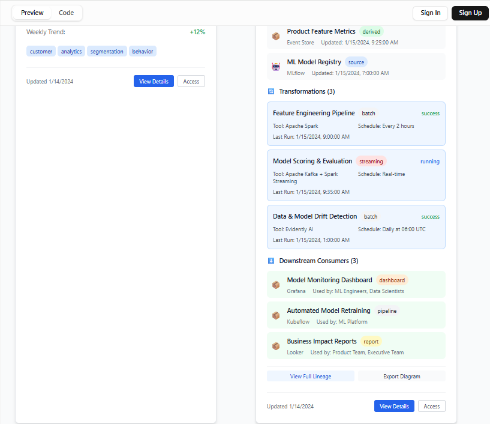

 **GPT’s Output**:Code

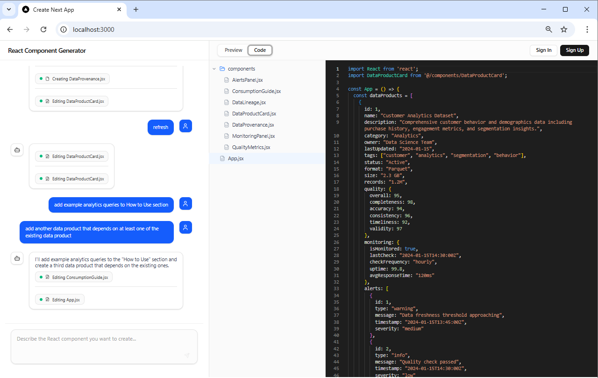
