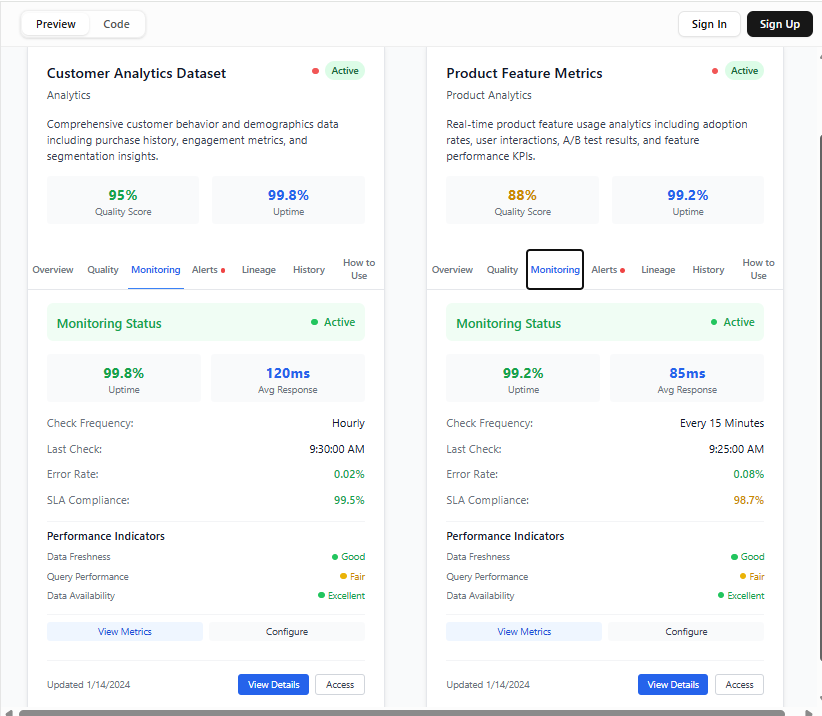
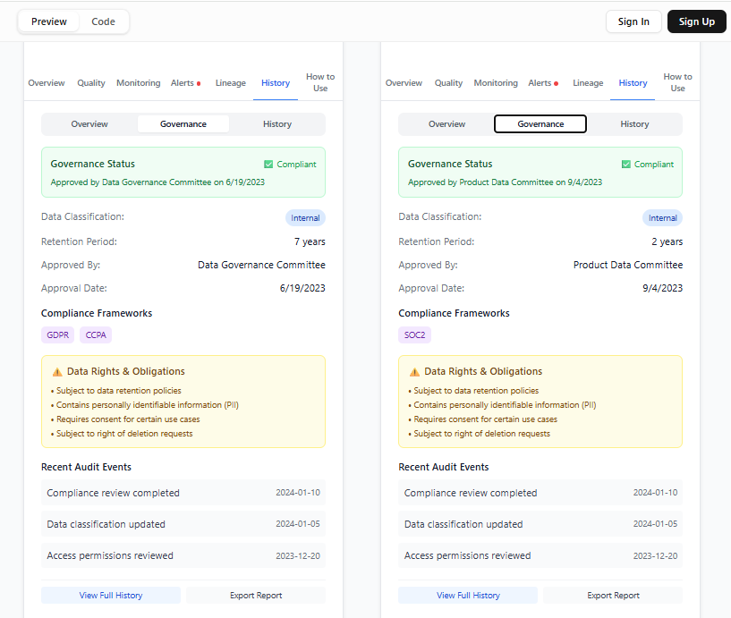

Introduction
=======

 **Prompt**: generate a card for data product catalog

 **GPT’s Output**:

 **Analysis**:

 **Prompt**: generate a card for data product catalog

 **GPT’s Output**:

 **Analysis**:

 **Prompt**: generate a card for data product catalog

 **GPT’s Output**:

 **Prompt**: add guide for how to consume

 **GPT’s Output**:

 **Analysis**:

 **GPT’s Output**:

 **GPT’s Output**: 6

 **GPT’s Output**: 7

 **GPT’s Output**: 8

 **GPT’s Output**: 9

 **GPT’s Output**: 10

 **GPT’s Output**:11

 **GPT’s Output**:12

 **GPT’s Output**:13

 **GPT’s Output**:Code

