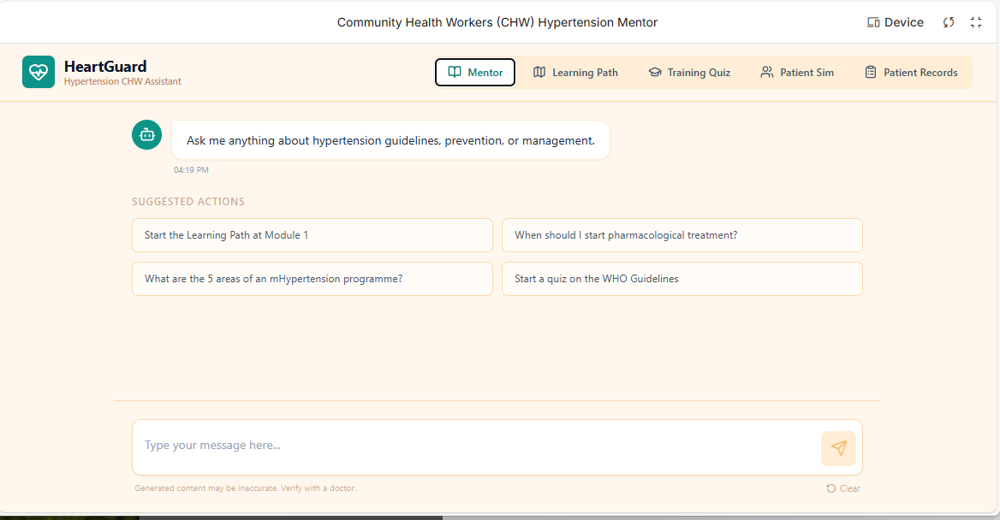
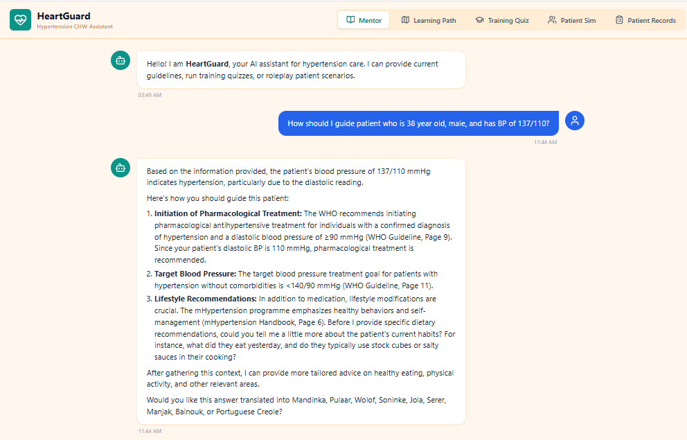
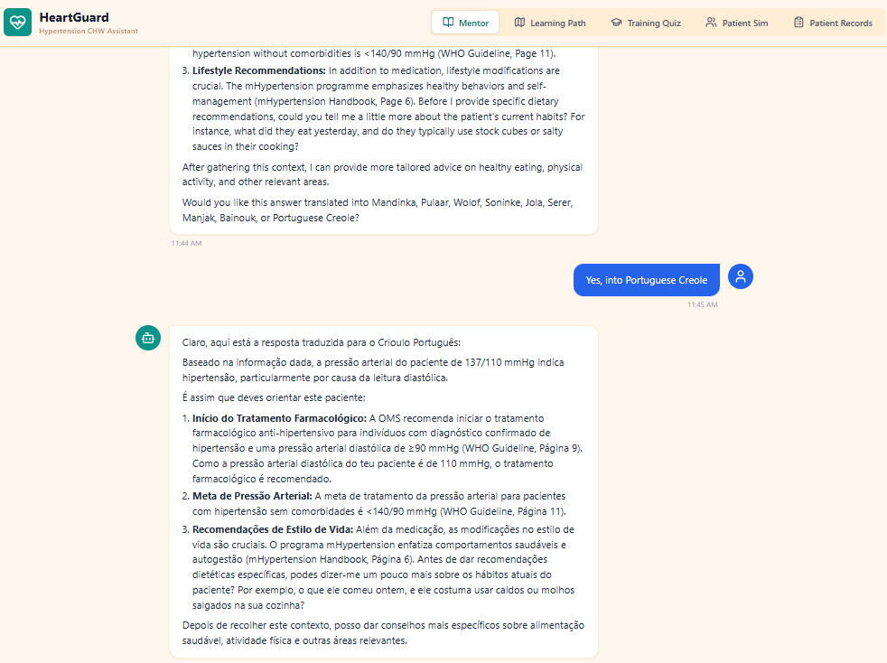
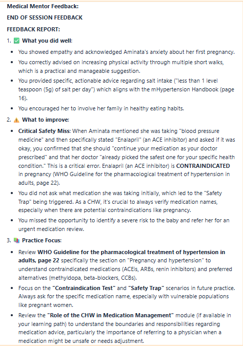

# Community Health Workers (CHW) Hypertension Mentor in Gambia
## HeartGuard Hypertension CHW Assistant

[Google DeepMind - Vibe Code with Gemini 3 Pro in AI Studio](https://www.kaggle.com/competitions/gemini-3/overview/tracks-and-awards)

|   |              |
|----------------------------------------------------------------|------------------------------------------------------------|


## Why?

IEEE Humanitarian Technologies (IEEE HT) and the International Telecommunication Union (ITU) are [harnessing generative AI](https://ieeeht.org/get-involved/funding-opportunities/genai-for-good/) to reduce the burden of Non-Communicable Diseases (NCDs) in The Gambia through a scalable, inclusive, and localized chatbot solution in collaboration with the World Health Organization (WHO), the [Be He@lthy, Be Mobile](https://www.itu.int/en/ITU-D/ICT-Applications/Pages/mhealth-for-ncd-behealthy-bemobile.aspx) initiative and the UN Inter-Agency Task Force on NCDs.

[Impact] NCDs are the leading cause of premature death in The Gambia. Nearly **half of all adults live with hypertension**, and one in five has multiple risk factors. Without new approaches, the burden will continue to grow—straining families and overwhelming health systems. **According to the WHO and ITU, chatbot-based interventions could save more than 400,000 lives globally in the next decade**.

## What?

Chatbot: Community Health Workers (CHW) Hypertension Mentor built in [Google AI Studio](https://aistudio.google.com/apps?source=) by using only prompts. Chatbot is intended for Community Health Workers in described Use Cases.

HeartGuard Chatbot Apps Link : https://ai.studio/apps/drive/1-QMrnEV0uD50o7Ob3NYxZertFehZgIIe?fullscreenApplet=true

YouTube Video : https://www.youtube.com/watch?v=1T2ivNFrKZE

## How?

- First, prompted to create a chatbot to provide hypertension knowledge for CH Workers.
- Next, I asked for a **learning path**, training via **quiz** and **simulation**.
  For instance, learning path has omse modules based on resource documents in its knowledge base 
  
- Next, (based on published [Relevant Resources](https://osaips.atlassian.net/wiki/external/NjkzOTYxZjIzZWJiNGUxYzlhYTBiMWE4OTE0OTViZWE)), restricted knowledge base to two documents.
- Next, I thought that these two documents may not be updated frequently, then prompted [Google AI Studio](https://aistudio.google.com/apps?source=) to consider NIH publications when there is not enough information in the given documents. This should allow CH Workers to access the recent medical information about hypertension, prevention, and management (=> [constants.ts](./HeartGuard/constants.ts) added secondary source into its prompt).
  
- Next, prompted to add a feature to **record a patient's progress** (=> Patient Records).
  AI Studio created [PatientService](./HeartGuard/services/patientData.ts) code with *listPatients*,
  *getPatientByName*, *getPatientById*, *registerPatient*, *recordVitals*, *scheduleAppointments* API and storing these records  into *localstorage*. [MCP Tools](.//HeartGuard/services/mcpTools.ts) defined these as function tool. [Gemini Service](../HeartGuard/services/geminiService.ts) handles LLM calls. 

- Next, prompted to add **translation of English text responses to one of the local languages** spoken in Gambia.
  
- Next, prompted to update background colors.
- Next, prompted to add **multiple patient profiles to Patient Simulator** so that CHW will have opportunity to practice with different patient profiles.
  For instance, Alex is 55 year old male, and skeptical about medication.  
```
    name: "Alex",
    age: 55,
    bp: "145/92 mmHg",
    scenario: "Grade 1 Hypertension. Eats a lot of canned soups and pickles (high sodium). Skeptical about medication.",
    personality: "Defensive about diet but willing to listen to logic.",
    behavioralRules: `
    - **The Diet Trap**: If the CHW gives generic diet advice (e.g., "eat less salt") WITHOUT asking you what you eat first, become defensive ("I don't put salt on my food!").
    - **The Unlock**: If the CHW asks what you ate recently or specifically asks about canned foods/sauces, admit to eating soup and be open to changing that specific habit.|

```
  For instance, Aminata is 28 year old pregnant woman, and taking Enalapril daily.  
```
  name: "Aminata",
    age: 28,
    bp: "142/92 mmHg",
    scenario: "3 months pregnant. Has had high blood pressure for 2 years. Currently taking Enalapril (an ACE inhibitor) daily from an old prescription.",
    personality: "Anxious first-time mother. Very protective of the baby but assumes her current medicine is safe because a doctor gave it to her years ago.",
    behavioralRules: `
    - **The Safety Trap**: If the CHW tells you to "continue your medication" without asking what it is, say "Okay, good, I'll keep taking my Enalapril." (This is a FAIL for the CHW as ACEis are unsafe in pregnancy).
    - **The Contraindication Test**: You will not mention the specific drug name unless asked "What medication are you taking?".
    - **The Unlock**: If the CHW identifies that Enalapril is NOT safe for the baby and refers you to a specialist to switch to a safe drug (like Methyldopa or Labetalol), be very grateful and agree to go immediately.
    `
```
- Finally, prompted to **provide feedback to CH Worker** after completing a patient simulator case so that CHW knows what was good, what needs to be improved, and what needs to be re-studied.
  For instance, when I tested **Patient Simulator**, HeartGuard chatbot generated the following feedback after the simulator session. 


## Summary

- Considering the scope of [GenAI For Good](https://ieeeht.org/get-involved/funding-opportunities/genai-for-good/) [Challenge for Gambia](https://ieeeht.org/wp-content/uploads/2025/10/GenAI4GC-Fact-Sheets-13.pdf), this chatbot addressed some of these use cases for one persona. However, the speed of building something useful is impressive.
- Although I just started utilizing [Google AI Studio](https://aistudio.google.com/apps?source=), I can easily predict how such tools will accelerate many steps in GenAI product development.

## References
1. [Google AI Studio](https://aistudio.google.com/apps?source=)
1. [HeartGuard Chatbot](https://ai.studio/apps/drive/1-QMrnEV0uD50o7Ob3NYxZertFehZgIIe?fullscreenApplet=true)
1. [IEEE GenAI For Good](https://ieeeht.org/get-involved/funding-opportunities/genai-for-good/)
1. [Use Case: AI-Chatbot for Prevention and Control of non-communicable diseases (NCDs) in The Gambia](https://ieeeht.org/get-involved/funding-opportunities/genai-for-good/health/)

