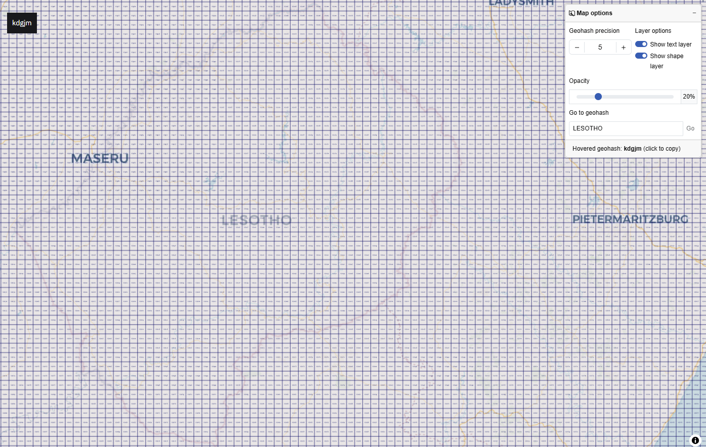

# Readme

[AI Farming Buddy in Lesotho](https://github.com/ozdemirht/generative-ai/blob/main/Kaggle-Google-GenAI-2025/kaggle-ai-google-capstone.ipynb) is a capstone project for [5-Day AI Agents Intensive Course with Google](https://www.kaggle.com/learn-guide/5-day-agents)

[kaggle-ai-google-capstone.ipynb](https://github.com/ozdemirht/generative-ai/blob/main/Kaggle-Google-GenAI-2025/kaggle-ai-google-capstone.ipynb)

[Kaggle Notebook - kaggle-ai-google-capstone ](https://www.kaggle.com/code/ozdemirht/kaggle-ai-google-capstone)

Through the [GenAI for Good Challenge](https://ieeeht.org/get-involved/funding-opportunities/genai-for-good/), IEEE Humanitarian Technologies (IEEE HT) and the International Telecommunication Union (ITU) are seeking prototype an AI-powered solutions that can provide and scale timely information for agricultural advisors and smallholder farmers in Lesotho. Agriculture employs nearly one-third of Lesotho’s workforce. But farmers and agricultural advisors face limited services, scarce digital tools, and mounting climate pressures. Without new solutions, food security and rural resilience will remain at risk. (see Geography and Climate in [Lesotho](https://en.wikipedia.org/wiki/Lesotho))

