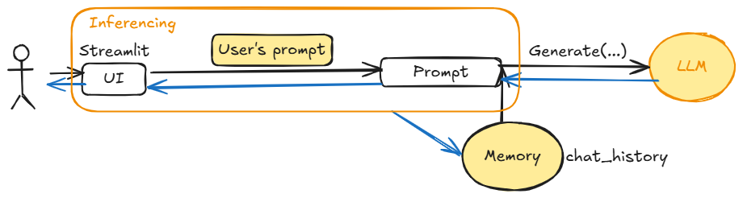
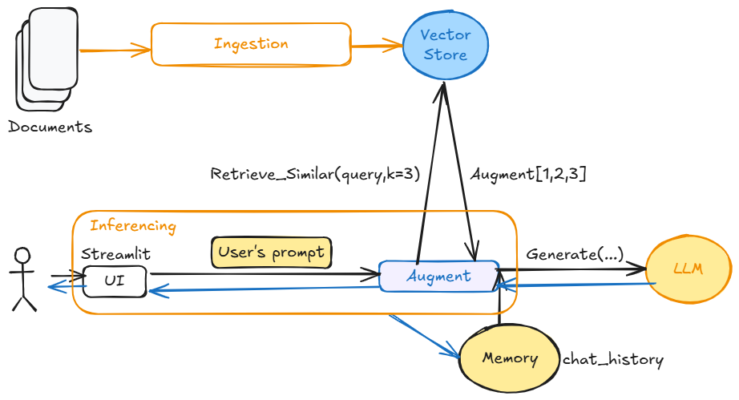
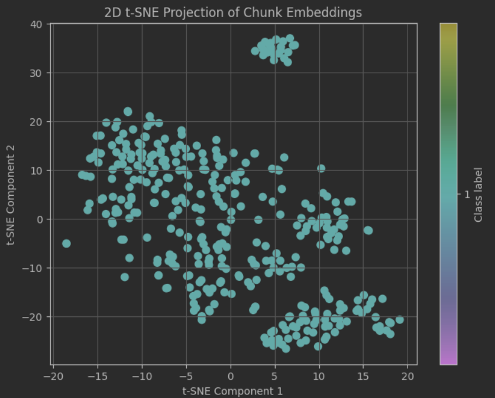
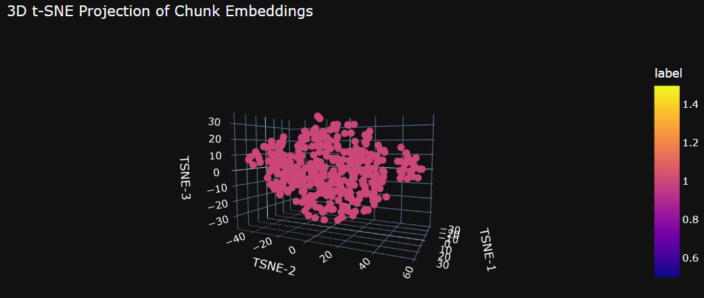
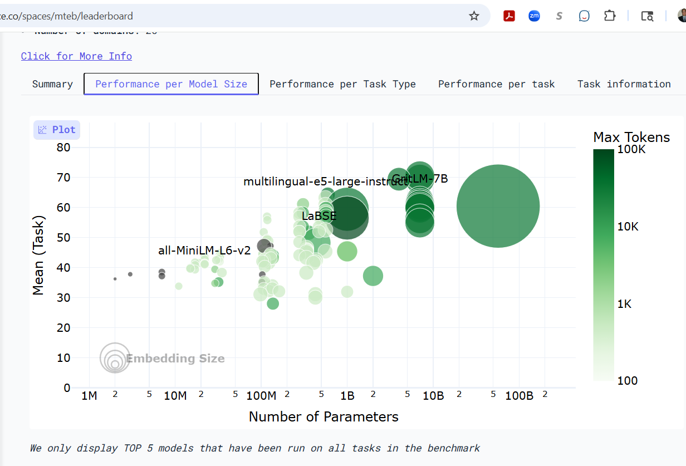
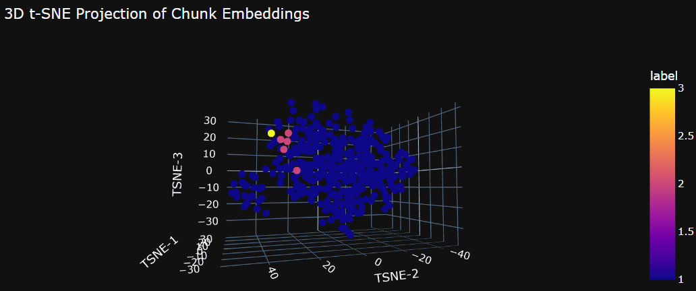
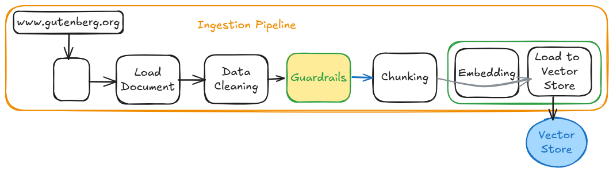
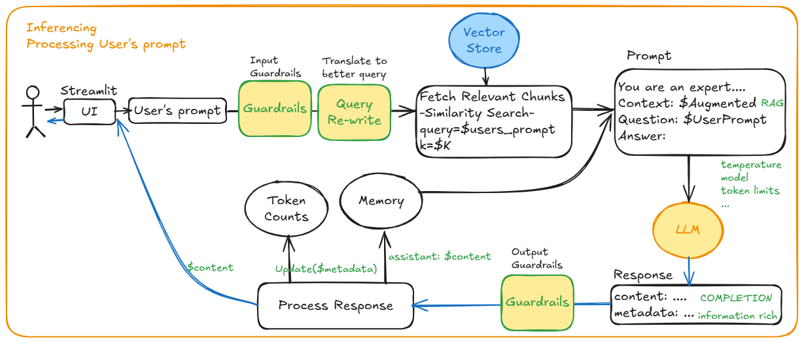
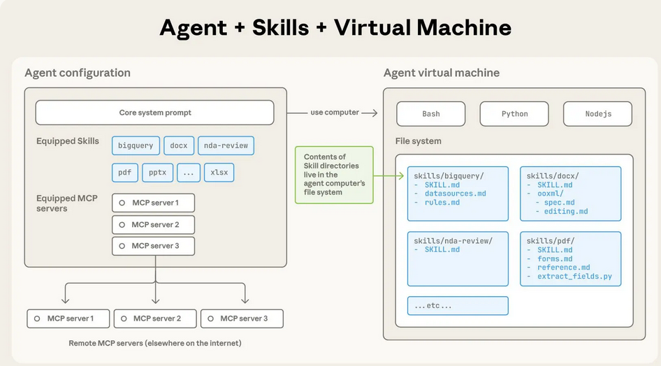

# Chat with your book (LLM with naive RAG)

## Motivation
The objective is to deep dive all steps of Retrieval Augmented Generation (RAG) solution 
while considering the product lifecycle from inception to sunset. 
After we ship a solution to production and customers hire this solution for their jobs to be done, 
we should be aware of TCO (Total Cost of Ownership) regardless of whether it is an internal/external facing product for internal/external and paying/non-paying customers.

| Generation without Augmentation                     | naive RAG                             |
|-----------------------------------------------------|---------------------------------------|
|  |  |


There are many use cases for Retrieval Augmented Generation (RAG), and we could categorize these use cases as;
   - unchanging corpus, 
   - evolving corpus, 
   - requiring user specific information in addition to unchanging/evolving corpus.

Here are a few example use cases. 

**Bookworm**: A user is able to discuss the book with this application (Bookworm). 
Ask the application to read (audio) the book or selected parts of the book. 
Bookworm enjoys engaging with a user for a selected book, characters, events, story line. Bookworm could recommend other books based on conversation with a user. 
Of course, Bookworm can utilize audio or text to carry out these conversations. 
Along the same trend of thought, Bookworm-like applications could be an interface to newspapers’ or magazines’ content. 

**PM-Assistant**: When we are operating software systems (that we developed), 
an on-call becomes the responsibility of the same software team. 
The team will receive asks in the form of JIRA issues from patrons. 
Every sprint planning meeting, based on available capacity, importance, urgency, and confidence, 
a team needs to decide which JIRA issues to work on the coming sprint. 
It helps to have a summary view to guide decision making. 
A PM-Assistant could help to summarize what the top-10 pain points from JIRA issues (closed ones in the last 3 sprints and waiting in backlog) 
by considering the importance, needs by date, and other criteria available in JIRA Issue fields. 
The PM-Assistant could also help us to categorize and decide the priority of the next set of development items based on ROI calculated from existing JIRA issues 
and availability of members. Humans are the decision makers while 
LLM handles undifferentiated heavy lifting by gathering and summarizing JIRA issues of our team every day. 
This solution enables real-time data-driven informed decision making.   

**Onboarding-Companion**: Onboarding new members to a software engineering team happens multiple times in a year. 
We assign a buddy to accelerate the onboarding process while investing in training materials. 
In this use case, a new engineering team member could interact with a corpus of architecture documents, 
software design document, software requirements documents, product requirements documents,  
test documents, ADR (architecture design records), 
JIRA tickets, relevant CVEs, CICD scripts, monitoring scripts, 
runbooks, RCA/CoE documents, and source code via Onboarding-Companion. 
This application could prepare quizzes to test retention of knowledge about the runbooks or modules in the software system. 
Onboarding-Companion could create mock JIRA tickets and assess new member’s solutions.
Onboarding-Companion could create mock on-call scenarios to evaluate new member’s performance. 
These solutions could help us to improve how we onboard new members today by 
training on available materials, asking questions to team members, 
shadowing (by observing experienced members in action), 
reverse-shadowing (by receiving feedback from experienced members), 
and finally being ready to drive by themselves. 
Onboarding-Companion could support on-call as a knowledgeable on-call assistant.

**Study-Buddy**: Students prepare for assessments, for the classes they are taking, to demonstrate their mastery. 
Generally assessments given in the prior years are available. 
These prior assessments, student class notes, teacher’s class notes, and teacher’s recordings can build a topic specific document base (corpus) for a study-buddy. 
An LLM can help students to master the topic by interacting conversationally,  
engaging in Q&A, giving assessments and identifying improvements, 
and personalizing learning experience for the student. 
If the operating costs are reasonable, a Study-Buddy could generate short videos (for instance, using Sora 2) to explain material/concepts, 
enact experiments/events, or find a segment of existing multimedia. 
A Study-Buddy could take an animated character form (via video generators) for engaging user experience. 
A Study-Buddy could tune into the student’s learning styles (visual learner, auditory learner (by listening), read/write learners, kinesthetic learners (by doing)) 
for this class. Similarly, Driver Ed class could also utilize Driver Manual as a topic to be mastered.  

**Patent-Assistant**: An important step in patent application preparation is to find existing relevant patents and patent applications. 
Some large companies have specialized teams to help with these searches and verify the probability of success. 
Members of these teams are trained and developed skills to conduct these searches efficiently and evaluate each finding against the application in preparation. 
A Patent-Assistant based on LLM can support search as well as prepare comparative analysis by using the claims. 
Furthermore, a Patent-Assistant could help to identify **whitespaces** in intellectual property landscape.


**Course-Selection-Assistant**: High school students start to face the course selection process (preparation for next level of education). 
The high school policy manual(Student Handbook) explains all the rules about the graduation such as mandatory courses/tracks, number of credits, mandatory exams. 
The school courses document (program of studies) explains the available courses and dependencies between these courses if any. 
Each student needs to select and submit their course selection before the published deadline by considering the current policies, 
current available courses, graduation requirements and courses completed. 
An application can ingest the policy and courses document to answer questions on these. 
A Course-Selection-Assistant will need a way to figure out which courses a particular student has completed so far. 
A ‘tool’ mechanism allows LLM to ask for further information. 
For instance, a Course-Selection-Assistant could ask for list of completed courses 
and invoke a tool that can retrieve a list of completed courses for this student. 
Then the Course-Selection-Assistant could assess completed courses, earned credits, etc. 
with respect to the policy, available courses, and course schedules to recommend course-selection alternatives. 
After the Course-Selection-Assistant has enough information about the student, 
it could engage in what-if scenario analysis based on available paths.  

**Benefits-Selection-Assistant**: Employees select and register for benefits annually. 
Employees need to decide on many items with a plethora of options. 
For instance, for health benefits, an employee needs to find out which family members are eligible (federal and state laws/regulations), 
find out which plans are probably better based on recent health history and offered plan coverages, 
find out FSA or HSA and contribution amount, etc. For instance, for retirement investment, an employee needs to find out contribution limits, 
find out which investment vehicle is available and hopefully better suited (IRA, Roth IRA, Gold IRA, 401K, etc.), 
tax considerations, prior tax filings, prior tax exceptions/incentives, etc. 
There are interdependencies between these choices in addition to constraints federal and state laws and regulations define. 
Every employee needs to solve their constrained multi-objective optimization problem every year during the registration window. 
A Benefits-Selection-Assistant could be a powerful companion for each individual during this process. 
Applicable federal and state laws and regulations (such as tax), available benefits and their coverage, etc. 
go into the base corpus. Benefits-Selection-Assistant can do Q&A based on base documents. Benefits-Selection-Assistant will need to collect specific data from an individual or 
systems individual granted read access to so that  Benefits-Selection-Assistant could present feasible selections and 
converse about these selections and reasoning with citations. 
Employees will be able to make informed decisions while being aware of a large body of documents. 

**Vocabulary-Buddy**: A learner could give documents (reading assignment) to master the new words in these documents. 
Vocabulary-Buddy utilizes this corpus to generate assessments (quizzes) by leveraging LLM. 
Vocabulary-Buddy persists each learner’s prior assignments and assessments so that it can give better context to LLM. 
For instance, LLM may ask the list of words a learner answered correctly with probability of >75%, 25%<75%, and <25% (quiz generation policy) so that a generated quiz contains questions with different difficult levels for the learner. 
Vocabulary-Buddy could fine-tune the policy (RL) based on the learner’s feedback so that it can establish a sustained user engagement. 

**Teller-Agent**: ATMs have been deployed, but LLMs have potential to push these to the next level by its multimodal interaction capabilities. 
An application can fulfill the current functionalities as well as offer personalized products to patrons by combining individual information (via tools) with available products (via vector store) and asking LLM to generate product recommendations. 

[List Of GenAI Use Cases](../List-Of-GenAI-Use-Cases.md) has more use cases. 

## Introduction

Documents are downloaded from https://www.gutenberg.org/, Project Gutenberg is an online library of more than 75,000 free eBooks. 
Objective is to build a Q&A chatbot that allows user to load a book then talk about a book with LLM. 

It is based on Retrieval Augmented Generation (RAG). UI is based on streamlit, 
LangChain is leveraged to define processing pipelines. 

It will look also look at from operational perspective (especially cost and token usage).
Where we decide to place a function will have a long term impact. 


## Pipeline
 1. Ingestion
     1. Load document 
     1. Clean text data (regex, NLTK, spaCy, etc.)
     1. Chunk/split text
     1. Calculate embedding vector of each chunk
     1. Store embedding vector and chunk to vector database 
1. Q&A Session (Inferencing)
    1. Accept user query
    1. Select relevant context from vector database via similarity search
    1. Generate a prompt, containing instructions, context, and user's question
    1. Invoke LLM to generate a response
    1. Present response to the user
    1. Update memory and wait for the next question (goto 2.i)

## Ingestion


### Data Cleaning

- remove extra white space
- replace '\r\n' by '\n'
- stopwords

### Chunking

This process splits the document into chunks that will be embedded (transformed to vector representation).
There needs to be some linkage between chunks.
The **content characteristics** (e.g., unstructured vs structured) is an important consideration when deciding chunking strategy. 

A good splitter for the content at hand will highly likely to produce better relevant data. That will directly impact the quality of completion. 
These content splitters will require chunk length and chunk overlap (to link consecutive chunks).
[LangChain Text Splitters](https://docs.langchain.com/oss/python/integrations/splitters) lists the available splitters. 

**chunk_overlap** : Is there other ways to express such linkage?


Let's say chunk_size=1000 and chunk_overlap=100 (10% of chunk_size). 
Except the first and the last chunks, all chunks will have effectively 800 characters.
Hence, the final document size stored in vector store will increase by (1000/800)=125%, 
this amplification is due to chunk_overlap. For instance, if the original document size is 100K, 
then 125% amplification results in (100K*125%=)125K stored document size in vector store. 
It can be generalized as  

$$Amplification=\frac{chunk\_size}{chunk\_size - (2* chunk\_overlap)} *100\%$$

**Conclusion**: There are many splitters with configuration options. 

### Embedding
In this step, each chunk is embedded to a vector space, that representation will be used for retrieval 
by using cosine similarity metric (similarity search). 
Retrieved chunks via similarity search are "A" in RAG, query is the user's prompt.
These chunks are send to LLM Provider as a **context** in the **rag prompt**. 

| Chunk Id    | Content                                 | Embedding |
|-------------|-----------------------------------------|-----------|
| chunks[40]  | [Now I say that those dominions w ...]  | [-0.02507091  0.01606758  0.06972311 -0.11896194 -0.04349811 -0.0283208 ] ...| 
| chunks[41]  | [only to bear in mind two conside ...]  | [-0.012266    0.05484197  0.01756565 -0.09092116 -0.0095341  -0.02421725] ...|
| chunks[42]  | [spot, disorders are seen as they ...]  | [ 0.079357    0.06106947  0.08273438  0.02950769 -0.04516806  0.07001141] ...|
| chunks[43]  | [prince does not spend much on co ...]  | [ 0.05889072  0.04274347  0.09256141  0.04474926 -0.0202273   0.01886031] ...|

Vector is used as a key of the corresponding chunk. 


Once, an application loads all chunks to vector store, each chunk is a point in the following graphs. 
(see [VS Retrieval with FAISS](./src/Retrieval_FAISS.ipynb) for code and details)

| 2D                        | 3D                        |
|---------------------------|---------------------------|
|  |  |


**Note**: Very large documents ingestion via streaming 

There are [many embedding](https://docs.langchain.com/oss/python/integrations/text_embedding) provider options. At the top level,
- LLM Provider (OpenAI,Gemini, Claude, ...) - model selection trade-off cost vs accuracy. 
- Local - model selection trade-off latency vs accuracy. Running these models will require an infrastructure. 
  The cost of running this infrastructure vs the cost of token consumption for embedding. 


| LLM Provider | Token Cost? | Infrastructure cost? | Model          | Accuracy | Latency | Note |
|--------------|-------------|----------------------|----------------|----------|---------|------|
| OpenAI       | Yes         | minimal              | gpt-5-nano     |          | High    |      |
| Local        | No          | ? need machine       | EmbeddingGemma |          | ?       |      |

<details>
<summary>Hugging Face: Embedding Leaderboard</summary>

[Hugging Face: Embedding Leaderboard](https://huggingface.co/spaces/mteb/leaderboard)

</details>

**Scalability** with respect to the size of document corpus needs to be considered. 
What if the application needs to store 100, 1000, or 1,000,000 medium size documents?
How will it impact the latency and quality of retrieval? 
Will k=3 or 4 be sufficient to provided meaningful augmentation for each user's query?

**Conclusion**: There are many options & architectural compositions.

- [Claude Embeddings](https://docs.claude.com/en/docs/build-with-claude/embeddings), there are corpus specific embedding models also.
- [EmbeddingGemma on Hugging Face](https://huggingface.co/google/embeddinggemma-300m)
- [SentenceTransformers Documentation](https://www.sbert.net/)
- [BGE Embeddings on Hugging Face](https://docs.langchain.com/oss/python/integrations/text_embedding/bge_huggingface)
- https://ollama.ai/
- [Matryoshka Embeddings](https://sbert.net/examples/sentence_transformer/training/matryoshka/README.html)
- [Hierarchical Embeddings](https://github.com/nalexai/hyperlib)
- [Poincaré Embeddings for Learning Hierarchical Representations](https://arxiv.org/abs/1705.08039)

### Memory/Context Maintenance

Application have multiple options to manage memory through the LLM Session. 

- Local, application manages the memory of the session and attaches to related to prompts before sending to hosted LLM.  
  This increase the latency due to the amount data transferred and the number of input tokens hosted LLM should process. 
  As the session progress the accumulated data increases. There are many approaches to remediate such that keeping only messages of select roles, keeping only the recent context, summarize the selected messages as context (via LLM?).
- [Claude Prompt Caching](https://docs.claude.com/en/docs/build-with-claude/prompt-caching)   

### Prompt
Prompt quality is very important for quality completion. 
LangChain hub has some tested prompts. 
But, the optimization will require testing to figure out the acceptable cost/performance. 
The search space could get very large. The following table tried to enumerate all these dimension. 
This table do not contain neither all LLM Providers nor models or prompt variations.

| LLM Provider | Mode       | Prompt   | Response Quality | Cost |
|--------------|------------|----------|------------------|------|
| OpenAI       | gpt-5-mini | prompt_1 | y%               |      |
| OpenAI       | gpt-5-nano | prompt_1 | x%               |      |
| Claude       | haiku-4.5  | prompt_1 | ?%               |      |
| Claude       | sonnet-4.5 | prompt_1 | ?%               |      |

An evaluation set will be needed to determine which combination should be shipped.
Although there are plenty of best practices in Prompt Engineering, 
constructing a good prompt for the task at hand is still a [research topic](https://arxiv.org/abs/2510.01171). 

**Conclusion**: Need to experiment with content of "rag prompt".

### Submitting a user query (Inferencing)

When the system is building a context, 
a) it should be relevant to the given query, and 
b) it should not waste token budget and be aware of context_window size. 

The bigger context increases tokens/query and latency because LLM needs to process more 
(because attention mechanism's time complexity is not linear with respect to the number of tokens).
Recent research on linear and sub-quadratic methods could make the input length less of a concern 
while increasing inferencing/second and decreasing the capacity demand. 


#### Select relevant data from Vector Database by using a user query

For instance, 5 nearest neighbours of given query are  

| 	 | Index	| Distance	| Chunk	| Embedding |
|---|-------|-----------|-------|-----------|
| 0	| 43	| 0.623361	| prince does not spend much on colonies, for wi...	| [0.058890715, 0.04274347, 0.09256141, 0.044749... | 
| 1	 | 42	| 0.802146	| spot, disorders are seen as they spring up, an...	| [0.079357, 0.061069474, 0.08273438, 0.02950769... | 
| 2	 | 221	| 0.928903	| Never let any Government imagine that it can c...	| [0.050540738, 0.10423061, 0.01961176, -0.04452... | 
| 3	 | 44	| 0.945794	| ones they cannot; therefore the injury that is...	| [0.009223385, 0.07131818, 0.052186664, 0.00611... | 
| 4 | 64	| 0.956113	| this is not occasioned by the little or abunda...	| [0.013173358, 0.102018714, 0.061939694, -0.027... | 

This can be visualized as 



where yellow point is the query, purple points are 5 nearest neighbours, the remaining points are the indexed chunks in the vetor database. 
(see [VS Retrieval with FAISS](./src/Retrieval_FAISS.ipynb) for code and details)

**How to extract additional filtering conditions from user's query to guide retrieval?**
**SelfQueryRetriever** leverages another LLM call to extract metadata from the user's query. 
For instance, "Generate summary of what prof. X explained during the class on week-9 about the hill climbers?". 
Expectation is to identify, for instance, "class on week-9" so that the scope of search is not the whole semester.
FAISS, Chromadb, etc. all have filters to support focused retrieval. 
Another example is for instance finding restaurants serving  "italian" cuisine and located within 3 miles from our location. 
The second predicate is proximity search in 2D while the first predicate filters restaurants based on which cuisine served.

**How to prevent sending redundant chunks?**
**Maximum Marginal Reference** attempts to retrieve diverse set of chunks 
to prevent sending the same set of information as a context. 
Intuition is that **too** similar chunks may be redundant, hence, 
picking diverse set of augments but close to the query point should provide relevant and rich context.  

**How to prevent sending irrelevant parts in the chunks?**
**Compression (ContextualCompressionRetriever)** of augments review 
the returned chunks and takes out the part of chunk relevant to the query. 
Intuition is that not all information in the selected chunks are relevant for the user's query. 
Because it reduces the amount of context, it reduces the token consumption. 

**Are there other ways to represent 'relationship' between chunks and query?**
The motivation to pull relevant information is also brought in 
graph storage and retrieval solutions ([GraphRAG](https://microsoft.github.io/graphrag/)) 
as an alternative to the current vector stores based on representing each chunk/document 
as a vector in high dimensional space. 

#### Update Memory if needed

In this step, an application summarizes memory to stay within **context_window** constraint/budget.

#### Invoke with context and user query

The system finally calls LLM API to obtain a response, and presents to the user. 
If the system is user aware, 
then these systems could provide differentiated experience by using a differt LLM model (with more parameters). 

## Cost 
The cost of operation has several components
 1. Ingestion
    1. If the application is using LLM Provider for embedding, then there will be a cost for these tokens. 
    1. For instance, assuming 1k tokens = 750 words, then for each chunk, it is possible to calculate the number of tokens needed.
    1. Then, the aggregation of tokens of each chunk gives the total tokens for the ingested document. 
    1. Then, based on the text embedding model used, it can be calculated.
    1. For instance, text-embedding-3-small costs 0.03/1M and text-embedding-3-large costs 0.13/1M tokens.
 1. Inferencing 
    1. Embedding of user's prompt. If the service is using LLM provider, then there will. 
    1. Number of input and output tokens in each call
    1. Input tokens is determined by the tokenized form of prompt that system submits to LLM provider. For instance, RAG prompt has 3 parts; instructions, context, and user's prompt/question. 
    1. Output tokens is determined by the system when calling to LLM provider. Application can limit the number of tokens to be generated. This is a parameter in API call. 
    1. Input and Output Guardrails
 1. Testing during development
 1. Testing in deployment
 1. Maintenance


[Calculate-Number-of-Tokens.ipynb](./src/Calculate-Number-of-Tokens.ipynb) shows how to calculate token cost. 

## Testing for production readiness
Testing a RAG system for production is different from 
the Acceptance Tests done by an end-users, product team, or QA team. 

These systems require a golden tests (like needs of Supervised Reinforcement Learning) so that 
an automated evaluation can be executed as a decision criteria to ship to production or not.

Due to observed failures in production sessions, 
this golden tests expected to evolve. As long as the number of calls to hosted LLM API is within API rate limits, 
an automated evaluation can run these tests in parallel and hopefully the time to complete these automated tests are not a huge concern in deployment time.
Because, in operations, a capability to ship a revised system to production as quickly as possible is very important tool especially when a rollback is not a viable option.
Therefore, it is not preferable to have these preventive measures delaying the time to ship.  

These golden tests will include Q&A sessions with a hosted LLM. 
Due to increasing amount of tests, 
LLM-Judge relying on the best (and expensive) model probably the best bet to produce a better completions. 

### Evaluation Metrics
[A list of metrics for evaluating LLM-generated content](https://learn.microsoft.com/en-us/ai/playbook/technology-guidance/generative-ai/working-with-llms/evaluation/list-of-eval-metrics)
provides a good coverage on evaluating LLM output in many use cases.

## Failure Modes
The RAG system should need to handle many operational challenges such as 
   1. how to handle rate limiting errors from hosted LLM.
   1. how to handle network connectivity issues.
      1. For instance, LLM response does not arrive due to intermittent network connection.   
   1. how to handle unresponsive (hosted) vector database.

There are known best practices to handle stateless and stateful interactions in distributed systems. 
Today, most hosted LLM provides a stateless API. 
Therefore, application needs to maintain the state of session. 
Should the application persist this state data after every change so that it could recover (like WAL files in database/Kafka)?

## CICD and Ops
Automated deployment pipelines are well understood. 
In addition to known (resource utilization metrics, 
performance metrics p90/p95 latency, etc.), rate limiting, etc.), 
operations also needs to monitor
- prompt attacks,
- guardrail violations,
- input and output token consumption, 
- total token consumption,
- hosted LLM API latency with respec to 1st generation,...,nth generation in a session,
- hosted LLM rate limiting errors, 
- quality of response (assuming that the system is collecting feedback on the generated responses). 

### Observability 

Trace of interactions within a session is important data 
to understand the behavior of the system and improve each step. 
As Agentic AI transform execution flow from "how" to "what", developers need a tool to understand 
how an agent decided to utilize available context, tools, resources, APIs, MCP servers.  

The cost of operations largely depends on the token consumption and 
the observability tools will surface such information at very fine granularity.
For instance, which application is consuming the most tokens, which sessions are consuming the most tokens, 
which step in these flows is consuming the most token, etc.
These insights will help us to decide where we will invest to improve the system's cost/performance.  

## Disaster Recovery

A production system should have a plan to handle large scale disruptions. 
Today, there are best practices in place to manage our infrastructure and services. 
However, operating a LLM-RAG based system will introduce new problems due to new dependencies.  
For instance, outage by major cloud infrastructure provider make hosted LLMs unreachable.  
For instance, disruption during loading embeddings data to a hosted vector storage may corrupt what has been stored in the vector database. 
For instance, update of slowly changing document corpus maybe disrupted. How could it be verified that the vector database has the complete and accurate retrieval data? 
Should we be worried about the integrity of data in vector database as a security threat surface?

As more of these workloads shipped to production, 
there will be more challenges and lessons learned and finally evolving best practices. 

## Continuous Maintenance
Today, there are MLOps best practices to manage model drift. 

LLM vendors will continue to offer new models at different cost/performance points. 

For instance, what the scope of change is
- when the chosen embedding needs to change, or 
- when the chosen LLM model needs to change.

Is moving to better and brighter LLM model the same as replacing our current machine with a brand new one?
These changes will likely to require in-depth assessments before making a decision. 

Eventually, these should be reduced to managing 
these changes as a system configuration data 
in a secure hub (like [AWS Systems Manager Parameter Store](https://docs.aws.amazon.com/systems-manager/latest/userguide/systems-manager-parameter-store.html)). 

**Cost of change** is an important criteria to verify in each step of SDLC processes. 
Our processes should be biased towards avoiding **cascaded changes** in these systems. 
Therefore, (classics) loose coupling, configurability, extensibility, etc. software system attributes should be enforced (by an LLM-as-a-Judge).  

**Pace of change** in technical capabilities will drive the modernization activities as long as it is within the organization's cadence to absorb these changes. 
If it becomes too frequent, then finding a good ROI to convince CFO to sign off these modernization efforts will be a challenge.
At this point, it will depend on the company's appetite to stay with the older stack. 
Eventually, CFOs will figure out how to depreciate these investments. 

## Advanced RAG

Advanced RAG introduces additional steps to ingestion and inferencing pipelines for

- Guardrails to redact PII data, to refuse in-appropriate input/output, to prevent jailbreaking, to prevent prompt injection, 
  to keep LLM outputs on the topic, moderation (stay within brand/app guidelines), to prevent hallucination, to validate expected output syntax, etc. 
  and to be transparent about the actions taken on input or output.  
  - **PII data**: Application should not leak PII data to hosted LLM. 
    Therefore, an input sanitization component will process user's input to decide whether it is ok to submit to hosted LLM. 
    For instance, [Microsoft Presidio](https://microsoft.github.io/presidio/) can detect PII data, such as phone number, email, address, name, etc. 
    [Presidio Anonymizer](https://microsoft.github.io/presidio/anonymizer/) supports most anonymization use cases such as redaction, tokenization, synthetic replacement, encryption. 
  - **Hallucination**: Application should check LLM output before sharing with the user. The output should be **grounded**. 
    One approach is to validate against the chunks in vector store (by using retrieval step in RAG to select chunks as ground truth). 
    For example, Natural Language Inference/Entailment can validate the LLM output by using the augments from vector store. 
    NLI classifies LLM output as **consistent** or **inconsistent** based on shared context. See [Guardrails AI](https://www.guardrailsai.com/).  
  - **Named Entity Recognition** and **Text to Topic classification** help to scrutinize LLM output. These may rely on another LLM.
- Query re-writing to generate good completion by translating the user's prompt to an effective prompt. 


| Advanced RAG - Ingestion                         | Advanced RAG - Inferencing                    |
|--------------------------------------------------|-----------------------------------------------|
|  |  |

These additions harden the system while improving the quality of responses for production.

## Responsible AI
 
There are many approaches to shape LLM output, and these are not necessarily mutually exclusive. 

| Method                                                                   | Objective                                                                                                                                                        |
|--------------------------------------------------------------------------|------------------------------------------------------------------------------------------------------------------------------------------------------------------|
| Inference Sampling Methods (Temperature, Top-K,Top-P, Min-P,Beam Search) | Objective of these parameters to help LLM generate expected outputs.                                                                                             |
| Prompt Engineering                                                       | Objective is find the performant prompt to help LLM generate expected outputs.                                                                                   |
| RAG & Context Engineering                                                | Objective is to augment prompt with additional context to help LLM generate expected outputs.                                                                    |
| Fine-Tuning                                                              | Objective is to fine tune parameters of LLM, bias P(Y/X) probability distribution towards human preferences (RLHF), hence help LLM to generate expected outputs. |                                        |
| Guardrails                                                               | Objective is to sanitize *input* to LLM and *output* from LLM (to help LLM generate expected outputs).                                                           | 

Guardrails plays a pivotal role to validate both input before submitting to hosted LLM and output from LLM before sharing with the user/customer. 

Solutions need to balance securing sensitive data vs reducing MTTR (by using logs) and monitoring cost of operations (by monitoring token consumption). 
AOP solutions used today is applicable to collecting token consumption data, as an undifferentiated heavy lifting.  

## Summary

The number of implementation configurations when building ingestion and Q&A steps are considerable.  

Architecture choices will depend on the application, and its ROI. 
Because the cost of running some steps in owned infrastructure vs hiring hosted LLM for jobs to be done 
will position implementation choices to very different points on the TCO vs value grid.  

## Details

### Setup

```
pip install langchain
pip install langchain-openai
pip install faiss-cpu
```

### Directory Structure
```
RAG0
│   requirements.txt
│   Readme.md
│   .gitignore
│
├───src
│       core_llm.py
│       ui_main.py
│       Calculate-Number-of-Tokens.ipynb
│
├───data 
```

[ui_main.py](./src/ui_main.py) implements UI by using streamlit.

[core_llm.py](./src/core_llm.py) implements interfacing to LLM provider, langchain and OpenAI API.

## RAG Prompt
Application used the following prompt (see [ui_main.py](./src/ui_main.py)) in **hub.pull("rlm/rag-prompt")**.
```
prompt = """
You are an assistant for question-answering tasks. 
Use the following pieces of retrieved context to answer the question. 
If you don't know the answer, just say that 'I do not know.'. 
Use three sentences maximum and keep the answer concise.
Context: {context} 
Question: {question}
Answer:
"""
```

## References
 1. [OPENAI Pricing](https://platform.openai.com/docs/pricing)
 1. [Navigating OpenAI Embeddings API Pricing: Token Count vs. API Calls](https://community.openai.com/t/navigating-openai-embeddings-api-pricing-token-count-vs-api-calls/289081)
 1. [From Tokens to Costs: Embedding Estimation with OpenAI API](https://mindfulcto.com/from-tokens-to-costs-embedding-estimation-with-openai-api-8c535753a479)
 1. [OpenAI Apps-SDK](https://developers.openai.com/apps-sdk/deploy)
 1. [Claude Agent Skills](https://www.anthropic.com/engineering/equipping-agents-for-the-real-world-with-agent-skills)
 1. [LangGraph Workflows - Agents](https://docs.langchain.com/oss/python/langgraph/workflows-agents) 
 1. [Is RAG Dead? The Rise of Context Engineering and Semantic Layers for Agentic AI](https://towardsdatascience.com/beyond-rag/)
 1. [Google’s URL Context Grounding: Another Nail in RAG’s Coffin?](https://towardsdatascience.com/googles-url-context-grounding-another-nail-in-rags-coffin/)
 1. [Hugging Face: Embedding Leaderboard](https://huggingface.co/spaces/mteb/leaderboard)
 1. [Large language model for patent concept generation](https://www.sciencedirect.com/science/article/pii/S1474034625001946)
 1. [Verbalized Sampling: How to Mitigate Mode Collapse and Unlock LLM Diversity](https://arxiv.org/abs/2510.01171)
 1. [Redis LangCache](https://redis.io/docs/latest/develop/ai/langcache/)
 1. [Self Query Retriever](https://medium.com/@danushidk507/rag-x-self-query-retriever-952dd55c68ed)
 1. [OpenAI How to use Guardrails](https://cookbook.openai.com/examples/how_to_use_guardrails)
 1. [Provenance LLM](https://hub.guardrailsai.com/validator/guardrails/provenance_llm)
 1. [NeMo Guardrails](https://github.com/NVIDIA-NeMo/Guardrails)
 1. [LLM Red Team](https://www.trydeepteam.com/docs/what-is-llm-red-teaming)
 1. [A list of metrics for evaluating LLM-generated content](https://learn.microsoft.com/en-us/ai/playbook/technology-guidance/generative-ai/working-with-llms/evaluation/list-of-eval-metrics)

## Appendix

### Claude Agent Skills
See [Claude Agent Skills](https://www.anthropic.com/engineering/equipping-agents-for-the-real-world-with-agent-skills) for details.

