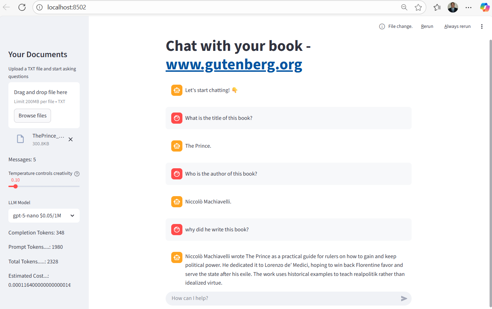

# Chat with your book (LLM with RAG)

## Motivation
The objective is to deep dive all steps of Retrieveal Augmented Generation (RAG) solution while considering the product lifecycle from inception to sunset. After we ship a solution to production and customers hire this solution for their jobs to be done, we should be aware of TCO (Total Cost Ownership) regardless of whether it is an internal/external facing product for internal/external and paying/non-paying customers.

There are many use cases for Retrieval Augmented Generation (RAG), and we could categorize these use cases as; a) unchanging corpus, b) evolving corpus, c) requiring user specific information in addition to unchanging/evolving corpus. Here are a few example use cases. 

**Bookworm**: A user is able to discuss the book with this application (Bookworm). Ask the application to read (audio) the book or select parts of the book. Bookworm enjoys engaging with a user for a selected book. Bookworm could recommend other books based on conversation with a user. Of course, Bookworm can utilize audio  or text to carry out these conversations. Along the same trend of thought, Bookworm-like applications could be an interface to newspapers’ or magazines’ content. 

**PM-Assistant**: When we are operating software systems (that we developed), an on-call becomes the responsibility of the same team. The team will receive asks in the form of JIRA tickets from patrons. Every sprint planning meeting, based on available capacity, importance, urgency, and confidence, a team needs to decide which JIRA tickets to work on the coming sprint. It helps to have a summary view to guide decision making. A PM-Assistant could help to summarize what the top-10 pain points from JIRA tickets (closed ones in the last 3 sprints and waiting in backlog) by considering the importance, needs by date, and other criteria available in JIRA fields. The PM-Assistant could also help us to categorize and decide the priority of the next set of development items based on ROI calculated from existing JIRA tickets and availability of members. Although humans are the decision makers, LLM handles undifferentiated heavy lifting by gathering and summarizing JIRA tickets of our team every day. This solution enables data-driven informed decision making.   

**Onboarding-Companion**: Onboarding new members to a software engineering team happens multiple times in a year. We assign a buddy to accelerate the onboarding process while investing in training materials. In this use case, a new engineering team member could interact with a corpus of architecture, design, test, ADR (architecture design records), JIRA tickets, relevant CVEs, CICD scripts, monitoring scripts, runbooks, rca/coe documents, and source code via Onboarding-Companion. This application could prepare quizzes  to test retention of knowledge about the runbooks or modules in the software system. Onboarding-Companion could create mock JIRA tickets and assess new member’s solutions, and create mock on-call scenarios to evaluate new member’s performance. These kinds of solutions could help us to change how we onboard new members: training on available materials, asking questions to team members, shadowing (by observing experienced members), reverse-shadowing (by receiving feedback), and finally being ready to drive by themselves. Onboarding-Companion could support on-call as a knowledgeable on-call assistant.

**Study-Buddy**: Students prepare for assessments for the classes they are taking to demonstrate their mastery. Generally assessments given in the prior years are available. These prior assessments, student class notes, teacher’s class notes, and teacher’s recordings can build a topic specific document base (corpus) for a study-buddy. An LLM can help students to master the topic by interacting conversationally,  engaging in Q&A, giving assessments and identifying improvements, and personalizing learning experience for the student. If the operating costs are reasonable, a study-buddy could generate short videos (for instance, using Sora 2) to explain material/concepts, enact experiments/events, or find a segment of existing multimedia. A study-buddy could take an animated character form (via video generators) for engaging user experience.A study-buddy could tune into the student’s learning styles (visual learner, auditory learner (by listening), read/write learners, kinesthetic learners (by doing)) for this class. 

**Course-Selection-Assistant**: High school students start to face the course selection process (preparation for next level of education). The high school policy manual explains all the rules about the graduation such as mandatory courses/tracks, number of credits, mandatory exams. The school courses document explains the available courses and dependencies between these courses if any. Each student needs to select and submit their course selection before the published deadline by considering the current policies, current available courses, graduation requirements and courses completed. An application can ingest the policy and courses document to answer questions on these. A course-selection-assistant will need a way to figure out which courses a particular student has completed so far. A ‘tool’ mechanism allows LLM to ask for further information. For instance, A course-selection-assistant could ask for a student's id and invoke a tool that can retrieve a list of completed courses for this student. Then the course-selection-assistant could assess completed courses, earned credits, etc. with respect to the policy and available courses to recommend course-selection alternatives. After the course-selection-assistant has enough information about the student, it could engage in what-if scenario analysis based on available paths.  

**Benefits-Selection-Assistant**: Employees select and register for benefits annually. Employees need to decide on many items with a plethora of options. For instance, for health benefits, an employee needs to find out which family members are eligible (federal and state laws/regulations), find out which plans are probably better based on recent history and offered coverage, find out FSA or HSA and contribution amount, and etc.  For instance, for retirement investment, an employee needs to find out contribution limits, find out which investment vehicle is available and better (IRA, Roth IRA, Gold IRA, 401K, etc.), tax considerations and prior filings, etc. There are interdependencies between these choices in addition to constraints federal and state laws and regulations define. Every employee needs to solve their constrained multi-objective optimization problem every year during the registration window. A Benefits-Selection-Assistant could be a powerful companion for each individual during this process. Applicable federal and state laws and regulations (such as tax), available benefits and their coverage, etc. go into the base corpus. Benefits-Selection-Assistant can do Q&A based on base documents.  Benefits-Selection-Assistant will need to collect specifics from individual or systems individual grant read access to so that Benefits-Selection-Assistant could present feasible selections and converse about these selections and reasoning with citations. Employees will be able to make informed decisions while being aware of a large body of documents.           

## Introduction

Documents are downloaded from https://www.gutenberg.org/, Project Gutenberg is an online library of more than 75,000 free eBooks. 
Objective is to build a Q&A chatbot that allows user to load a book then talk about a book with LLM. 

It is based on Retrieval Augmented Generation (RAG). UI is based on streamlit, 
LangChain is leveraged to define processing pipelines. 

It will look also look at from operational perspective (especially cost and token usage).
Where we decide to place a function will have a long term impact. 



## Pipeline
 1. Ingestion
     1. Load document 
     1. Clean text data (regex, NLTK, spaCy, etc.)
     1. Chunk/split text
     1. Calculate embedding vector of each chunk
     1. Store embedding vector and chunk to vector database 
1. Q&A Session (Inferencing)
    1. Accept user query
    1. Select relevant context from vector database via similarity search
    1. Generate a prompt, containing instructions, context, and user's question
    1. Invoke LLM to generate a response
    1. Present response to the user
    1. Update memory and wait for the next question (goto 2.i)

## Ingestion


### Data Cleaning

- remove extra white space
- replace '\r\n' by '\n'
- stopwords (?)

### Chunking

This process splits the document into chunks that will be embedded (transformed to vector representation).
There needs to be some linkage between chunks.
The **content characteristics** (e.g., unstructured vs structured) is an important consideration when deciding chunking strategy. 

A good splitter for the content at hand will highly likely to produce better relevant data. That will directly impact the quality of completion. 
These content splitters will require chunk length and chunk overlap (to link consecutive chunks).
[LangChain Text Splitters](https://docs.langchain.com/oss/python/integrations/splitters) lists the available splitters. 

**chunk_overlap** : Is there other ways to express such linkage?


**Conclusion**: There are many splitters with configuration options. 

### Embedding
In this step, each chunk is embedded to a vector space, that representation will be used for retrieval 
by using cosine similarity metric (similarity search). 
Retrieved chunks via similarity search are "A" in RAG, query is the user's prompt.
These chunks are send to LLM Provider as a **context** in the **rag prompt**. 


**Note**: Very large documents ingestion via streaming 

There are many embedding provider options. At the top level,
- LLM Provider (OpenAI,Gemini, Claude, ...) - model selection trade-off cost vs accuracy. 
- Local - model selection trade-off latency vs accuracy. Running these models will require an infrastructure. 
  The cost of running this infrastructure vs the cost of token consumption for embedding. 


| LLM Provider | Token Cost? | Infrastructure cost? | Model          | Accuracy | Latency | Note |
|--------------|-------------|----------------------|----------------|----------|---------|------|
| OpenAI       | Yes         | minimal              | gpt-5-nano     |          | High    |      |
| Local        | No          | ? need machine       | EmbeddingGemma |          | ?       |      |


**Conclusion**: There are many options & architectural compositions.

- [Claude Embeddings](https://docs.claude.com/en/docs/build-with-claude/embeddings), there are corpus specific embedding models also.
- [EmbeddingGemma on Hugging Face](https://huggingface.co/google/embeddinggemma-300m)
- [SentenceTransformers Documentation](https://www.sbert.net/)
- [BGE Embeddings on Hugging Face](https://docs.langchain.com/oss/python/integrations/text_embedding/bge_huggingface)
- https://ollama.ai/
- [Matryoshka Embeddings](https://sbert.net/examples/sentence_transformer/training/matryoshka/README.html)
- [Hierarchical Embeddings](https://github.com/nalexai/hyperlib)
- [Poincaré Embeddings for Learning Hierarchical Representations](https://arxiv.org/abs/1705.08039)

### Memory/Context Maintenance

Application have multiple options to manage memory through the LLM Session. 

- Local 
- [Claude Prompt Caching](https://docs.claude.com/en/docs/build-with-claude/prompt-caching)   

### Prompt
Prompt quality is very important for quality completion. 
LangChain hub has some tested prompts. 
But, the optimization will require testing to figure out the acceptable cost/performance. 
The search space could get very large. The following table tried to enumerate all these dimension. 
This table do not contain neither all LLM Providers nor models or prompt variations.

| LLM Provider | Mode       | Prompt   | Response Quality | Cost |
|--------------|------------|----------|------------------|------|
| OpenAI       | gpt-5-mini | prompt_1 | y%               |      |
| OpenAI       | gpt-5-nano | prompt_1 | x%               |      |
| Claude       | haiku-4.5  | prompt_1 | ?%               |      |
| Claude       | sonnet-4.5 | prompt_1 | ?%               |      |

An evaluation set will be needed to determine which combination should be shipped.

**Conclusion**: Need to experiment with content of "rag prompt".

### Submitting a user query (Inferencing)

When the system is building a context, 
a) it should be relevant to the given query, and 
b) it should not waste token budget and be aware of context_window size. 

The bigger context increases tokens/query and latency because LLM needs to process more 
(because time complexity is not linear with respect to the number of tokens). 


#### Select relevant data from Vector Database by using a user query
- **Maximum Marginal Reference** (retrieve diverse context document chunks)
- Compression (ContextualCompressionRetriever)
- SelfQueryRetriever

#### Update Memory if needed

- Summarize memory to stay within **context_window** constraint.

#### Invoke with context and user query
Here, the system finally calls LLM to obtain a response. 

## Cost 
The cost of operation has several components
 1. Ingestion
    1. If the application is using LLM Provider for embedding, then there will be a cost for these tokens. 
    1. For instance, assuming 1k tokens = 750 words, then for each chunk, it is possible to calculate the number of tokens needed.
    1. Then, the aggregation of tokens of each chunk gives the total tokens for the ingested document. 
    1. Then, based on the text embedding model used, it can be calculated.
    1. For instance, text-embedding-3-small costs 0.03/1M and text-embedding-3-large costs 0.13/1M tokens.
 1. Inferencing 
    1. Embedding of user's prompt. If the service is using LLM provider, then there will. 
    1. Number of input and output tokens in each call
    1. Input tokens is determined by the tokenized form of prompt that system submits to LLM provider. For instance, RAG prompt has 3 parts; instructions, context, and user's prompt/question. 
    1. Output tokens is determined by the system when calling to LLM provider. Application can limit the number of tokens to be generated. This is a parameter in API call. 


[Calculate-Number-of-Tokens.ipynb](./src/Calculate-Number-of-Tokens.ipynb) shows how to calculate token cost. 

## Summary
The number of configurations when building ingestion and Q&A steps are considerable.  

Architecture choices will depend on the application. 
The cost running some steps in owned infrastructure vs hiring LLM providers for jobs to be done. 

## Details

### Setup

```
pip install langchain
pip install langchain-openai
pip install faiss-cpu
```

### Directory Structure
```
RAG0
│   requirements.txt
│   Readme.md
│   .gitignore
│
├───src
│       core_llm.py
│       ui_main.py
│       Calculate-Number-of-Tokens.ipynb
│
├───data 
```

[ui_main.py](./src/ui_main.py) implements UI by using streamlit.

[core_llm.py](./src/core_llm.py) implements interfacing to LLM provider, langchain and OpenAI API.


## References
 1. [OPENAI Pricing](https://platform.openai.com/docs/pricing)
 1. [Navigating OpenAI Embeddings API Pricing: Token Count vs. API Calls](https://community.openai.com/t/navigating-openai-embeddings-api-pricing-token-count-vs-api-calls/289081)
 1. [From Tokens to Costs: Embedding Estimation with OpenAI API](https://mindfulcto.com/from-tokens-to-costs-embedding-estimation-with-openai-api-8c535753a479)
## Q&A

### Is there a difference between predict, generate, completion in LLM?
